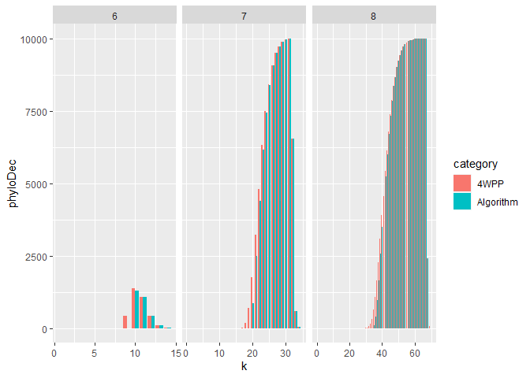

<!-- README.md is generated from README.Rmd. Please edit that file -->

# Simulation study to phylogenetic decisiveness

<!-- badges: start -->
<!-- badges: end -->

The goal of PhyloDecR_Simulation is to test random sets with n=6, 7, 8
taxa and compare speed and reply of Fischers Algorithm and the correct
test (4-way partition property).

**Definition** (4-way partition property). Let
*S*<sub>*n*</sub> = {*Z*<sub>1</sub>, ..., *Z*<sub>*k*</sub>} be a set
of quadruples of taxa set *X*, \|*X*\| = *n*. Then, *S*<sub>*n*</sub>
satisfies the four-way partition property (for *X*) if, for all
partitions of *X* into four disjoint, nonempty sets
*A*<sub>1</sub>, *A*<sub>2</sub>, *A*<sub>3</sub> and *A*<sub>4</sub>
(with
*A*<sub>1</sub> ∪ *A*<sub>2</sub> ∪ *A*<sub>3</sub> ∪ *A*<sub>4</sub> = *X*)
there exists *a*<sub>*i*</sub> ∈ *A*<sub>*i*</sub> for *i* = 1, 2, 3, 4
for which
{*a*<sub>1</sub>, *a*<sub>2</sub>, *a*<sub>3</sub>, *a*<sub>4</sub>} ∈ *S*<sub>*n*</sub>.

**Theorem** (Theorem 2 of [M. Steel and M.J.
Sanderson](https://www.sciencedirect.com/science/article/pii/S0893965909003000?via%3Dihub)).
A collection *S*<sub>*n*</sub> of quadruples of *X* is phylogenetically
decisive if and only if *S*<sub>*n*</sub> satisfies the four-way
partition property for *X*.

## Planned stuff

### Step 1: Create all partitions

for n=6, 7, and 8 (these partitions are fix)

-> See scripts/CreatePartitionX.R

The number of possible partitions is given by the Stirling numbers of
the second kind:

``` r
source("helperFunctions/myStirlingFunction.R")
myStirlingFunction(n = 6,k=4)
#> [1] 65
myStirlingFunction(n = 7,k=4)
#> [1] 350
myStirlingFunction(n = 8,k=4)
#> [1] 1701
myStirlingFunction(n = 9,k=4)
#> [1] 7770
myStirlingFunction(n =10,k=4)
#> [1] 34105
```

### Step 2: Create simulation function

–> See helperFunctions/mySimulationFunction.R and
mySimulationFunction_exact.R (the second one used only for n=6 as all
possible combinations were below 10,000)

``` r
# part of mySimulationFunction.R
# m = number of all possible quadruples for n taxa
# k = number of input quadruples

# Example 1: n=6, m=15, k=8, repeats=10000
n=6;m=15;k=8;repeats=10000
nr_allCombis = choose(m,k)
if(nr_allCombis<repeats) message("Testing all combination only once ...")
#> Testing all combination only once ...
if(nr_allCombis<repeats) repeats = nr_allCombis 
message("Working on ",repeats," repeats of ", nr_allCombis," combinations")
#> Working on 6435 repeats of 6435 combinations

# Example 2: n=7, m=35, k=18, repeats=10000
n=7;m=35;k=18;repeats=10000
nr_allCombis = choose(m,k)
if(nr_allCombis<repeats) message("Testing all combination only once ...")
if(nr_allCombis<repeats) repeats = nr_allCombis 
message("Working on ",repeats," repeats of ", nr_allCombis," combinations")
#> Working on 10000 repeats of 4537567650 combinations

# Example 3: n=8, m=70, k=35, repeats=10000
n=8;m=70;k=35;repeats=10000
nr_allCombis = choose(m,k)
if(nr_allCombis<repeats) message("Testing all combination only once ...")
if(nr_allCombis<repeats) repeats = nr_allCombis 
message("Working on ",repeats," repeats of ", nr_allCombis," combinations")
#> Working on 10000 repeats of 1.12186277816662e+20 combinations
```

### Step 3: Run simulations

–> See scripts/Simulation_nX.R

### Step 4: Summarize my results

–> See scripts/Simulation_Zusammenfassung.R

``` r
load("results/SimulationResults_n6.RData")
load("results/SimulationResults_n7.RData")
load("results/SimulationResults_n8.RData")
source("helperFunctions/my4FTFunction.R")

SimulationResults_n6[,n:=6]
SimulationResults_n7[,n:=7]
SimulationResults_n8[,n:=8]

simData = rbind(SimulationResults_n6,
                SimulationResults_n7,
                SimulationResults_n8)
PlotData = data.table(n = rep(simData$n,2),
                      k = rep(simData$k,2),
                      phyloDec = c(simData$NR_FAlg_pos,simData$NR_PhyloDec),
                      category = c(rep("Algorithm",dim(simData)[1]),
                                   rep("4WPP",dim(simData)[1])))

ggplot(data=PlotData,aes(fill=category, y=phyloDec, x=k)) + 
  facet_wrap(vars(n),scales = "free_x") + 
  geom_bar(position="dodge", stat="identity")
```

<!-- -->

``` r
stats_n6 = my4FTFunction(P = sum(SimulationResults_n6$NR_PhyloDec),
                         N = sum(SimulationResults_n6$NR_NotPhyloDec),
                         PP = sum(SimulationResults_n6$NR_FAlg_pos))
stats_n7 = my4FTFunction(P = sum(SimulationResults_n7$NR_PhyloDec),
                         N = sum(SimulationResults_n7$NR_NotPhyloDec),
                         PP = sum(SimulationResults_n7$NR_FAlg_pos))
stats_n8 = my4FTFunction(P = sum(SimulationResults_n8$NR_PhyloDec),
                         N = sum(SimulationResults_n8$NR_NotPhyloDec),
                         PP = sum(SimulationResults_n8$NR_FAlg_pos))
stats = rbind(stats_n6,stats_n7,stats_n8)
stats
#>    Prevalence PPV       NPV       TPR TNR
#> 1:  0.1044680   1 0.9835093 0.8562664   1
#> 2:  0.3337353   1 0.9840043 0.9675472   1
#> 3:  0.3927584   1 0.9880900 0.9813641   1
```

# ToDo

-   repeat stuff for n=9 and n=10?
-   discuss with Mareike
