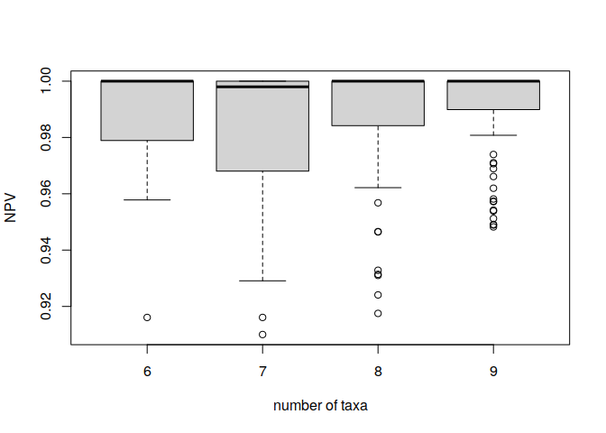

<!-- Simulation_n9.md is generated from Simulation_n9.Rmd. Please edit that file -->

# Summary of Simulations

<!-- badges: start -->
<!-- badges: end -->

What did I simulate?

**Preparation**: create all possible quadruples and all possible 4-way
partitions (4WP) for *n* = 6, ..., 10 taxa

**Simulation**: for *n* taxa, there are $K\_n=\\binom{n}{4}$ possible
quadruples. For each *k* ∈ {1, ..., *K*<sub>*n*</sub>}, there are
$M\_k=\\binom{K\_n}{k}$ combinations of quadruples as input and 10,000
of these *M*<sub>*k*</sub> combinations are used in the simulation. Each
combination is tested for phylogenetic decisiveness according to 4WP
(truth) and Fischers algorithm (test).

All simulation results are saved locally, the summary per *n* is also
stored on github.

**Here**: Summary of the simulation results (barplots, negative
predictive value, power).

Upper border: it was already shown that given an input of
$\\binom{n}{4} - (n-4)$ quadruples, all sets are phylogenetic decisive:

-   *n* = 6: 15 − 2 = 13
-   *n* = 7: 35 − 3 = 32
-   *n* = 8: 70 − 4 = 66
-   *n* = 9: 126 − 5 = 121
-   *n* = 10: *X* − 6 = *Y*

Lower border: there is no simple formular, but I use here my lower bound
from my master thesis (set size that covers all triples at least once):

-   *n* = 6: 6
-   *n* = 7: 11
-   *n* = 8: 14
-   *n* = 9: U
-   *n* = 10: V

# Initialize

I use a file names *mySourceFile.R* that contains all relevant R
packages and user-/server-specific path to the R library. If using this
code, you must make all the necessary changes within the template source
file.

``` r
rm(list = ls())
time0<-Sys.time()

source("../mySourceFile.R")
source("../helperFunctions/my4FTFunction.R")

x06_lb = 6
x06_ub = 13
x07_lb = 11
x07_ub = 32
x08_lb = 14
x08_ub = 66
x09_lb = 24
x09_ub = 121
#x10_lb = 14
#x10_ub = 66
```

# Get data

``` r
load("../results/SimulationResults_n6.RData")
load("../results/SimulationResults_n7.RData")
load("../results/SimulationResults_n8.RData")
load("../results/SimulationResults_n9.RData")

SimulationResults_n6[,n := 6]
SimulationResults_n7[,n := 7]
SimulationResults_n8[,n := 8]
SimulationResults_n9[,n := 9]

sim_n6 = SimulationResults_n6[k>=x06_lb & k<=x06_ub]
sim_n7 = SimulationResults_n7[k>=x07_lb & k<=x07_ub]
sim_n8 = SimulationResults_n8[k>=x08_lb & k<=x08_ub]
sim_n9 = SimulationResults_n9[k>=x09_lb & k<=x09_ub]

sim = rbind(sim_n6,sim_n7,sim_n8,sim_n9)
sim2 = rbind(SimulationResults_n6,SimulationResults_n7,
             SimulationResults_n8,SimulationResults_n9)
```

# Bar plots

``` r
dumTab1 = foreach(i = 6:9)%do%{
  # i=6
  mySim = copy(sim)
  mySim = mySim[n == i,]
  x1 = dim(mySim)[1]
  
  PlotData = data.table(n = i, 
                        k = rep(mySim$k,2),
                        phyloDec = c(mySim$NR_FAlg_pos,mySim$NR_PhyloDec),
                        category = c(rep("Algorithm",x1),rep("4WPP",x1)))
  ggplot(data=PlotData,aes(fill=category, y=phyloDec, x=k)) + 
    geom_bar(position="dodge", stat="identity")
  
  PlotData
}
BarPlotData = rbindlist(dumTab1)

ggplot(data=BarPlotData,aes(fill=category, y=phyloDec, x=k)) + 
  facet_wrap(vars(n), nrow = 2, scales = "free") +
  geom_bar(position="dodge", stat="identity")
```

<!-- -->

# Contingency tables (overall)

-   Prevalence = actual positive (P) / all (N+P)
-   PPV = Positive Predictive Value = true positives (TP) / predicted
    positives (PP) = conditional probability P(true state positive \|
    prediction positive)
-   NPV = Negative Predictive Value = true negatives (TN) / predicted
    negatives = conditional probability P(true state negative \|
    prediction negative)
-   TPR = True Positive Rate = sensitivity = power = TP / P
-   TNR = True Negative Rate = specificity = TN / N
-   see also
    [Wikipedia](https://en.wikipedia.org/wiki/Positive_and_negative_predictive_values)

``` r
dumTab2 = foreach(i = 6:9)%do%{
  # i=6
  mySim = copy(sim)
  mySim = mySim[n == i,]
  stats_1 = my4FTFunction(P = sum(mySim$NR_PhyloDec),
                          N = sum(mySim$NR_NotPhyloDec),
                          PP = sum(mySim$NR_FAlg_pos))
  mySim2 = copy(sim2)
  mySim2 = mySim2[n == i,]
  stats_2 = my4FTFunction(P = sum(mySim2$NR_PhyloDec),
                          N = sum(mySim2$NR_NotPhyloDec),
                          PP = sum(mySim2$NR_FAlg_pos))
  
  stats = rbind(stats_1,stats_2)
  stats[,n:=i]
  stats[,setting := c("filtered","all")]
  stats
}
myStats = rbindlist(dumTab2)
myStats[setting == "filtered"]
#>    Prevalence PPV       NPV       TPR TNR n  setting
#> 1:  0.1225547   1 0.9802346 0.8556338   1 6 filtered
#> 2:  0.4587227   1 0.9753862 0.9702236   1 7 filtered
#> 3:  0.4621434   1 0.9828505 0.9796927   1 8 filtered
#> 4:  0.5148582   1 0.9882147 0.9887625   1 9 filtered
myStats[setting == "all"]
#>    Prevalence PPV       NPV       TPR TNR n setting
#> 1:  0.1044680   1 0.9835093 0.8562664   1 6     all
#> 2:  0.3556441   1 0.9864692 0.9751487   1 7     all
#> 3:  0.3984580   1 0.9881582 0.9819085   1 8     all
#> 4:  0.4356488   1 0.9920265 0.9895879   1 9     all
```

**Fazit 1**: NPV is about 98%, i.e. there is a 98% probability that a
negative set is really not phylogenically decisive

**Fazit 2**: The power of the algorithm (TPR) is also about 98%.

# Contingency tables (per k)

``` r
dumTab3 = foreach(i = 6:9)%do%{
  # i=6
  mySim = copy(sim)
  mySim = mySim[n == i,]
  
  dumTab4 = foreach(k = 1:dim(mySim)[1])%do%{
    # k=1
    myRow = copy(mySim)
    myRow = myRow[k,]
    
    stats_k = my4FTFunction(P = myRow$NR_PhyloDec,
                            N = myRow$NR_NotPhyloDec,
                            PP = myRow$NR_FAlg_pos)
    stats_k[,n :=i]
    stats_k[,k := k]
    stats_k[,status := "filtered"]
    stats_k
  }
  myStats_k = rbindlist(dumTab4)
  myStats_k
}
myStats_k = rbindlist(dumTab3)

filt_TPR = !is.na(myStats_k$TPR)
filt_NPV = !is.na(myStats_k$NPV)

boxplot(myStats_k$TPR[filt_TPR] ~ myStats_k$n[filt_TPR],
        xlab = "number of taxa",
        ylab = "power")
```

<!-- -->

``` r
boxplot(myStats_k$NPV[filt_NPV] ~ myStats_k$n[filt_NPV],
        xlab = "number of taxa",
        ylab = "NPV")
```

<!-- -->

``` r
tab6 = myStats_k[n==6,summary(TPR)]
tab7 = myStats_k[n==7,summary(TPR)]
tab8 = myStats_k[n==8,summary(TPR)]
tab9 = myStats_k[n==9,summary(TPR)]
tab_TPR = rbind(tab6,tab7,tab8,tab9)

tab6 = myStats_k[n==6,summary(NPV)]
tab7 = myStats_k[n==7,summary(NPV)]
tab8 = myStats_k[n==8,summary(NPV)]
tab9 = myStats_k[n==9,summary(NPV)]
tab_NPV = rbind(tab6,tab7,tab8,tab9)

tabs = as.data.table(rbind(tab_NPV,tab_TPR))
tabs[,n:=rep(c(6:9),2)]
tabs[,Parameter:=c(rep("NPV",4),rep("TPR",4))]
tabs = tabs[,c(9,8,1:7)]
tabs
#>    Parameter n      Min.   1st Qu.    Median      Mean 3rd Qu. Max. NA's
#> 1:       NPV 6 0.9160839 0.9789104 1.0000000 0.9819864       1    1    1
#> 2:       NPV 7 0.9100188 0.9680436 0.9979960 0.9794437       1    1    1
#> 3:       NPV 8 0.9175184 0.9850031 1.0000000 0.9858215       1    1    3
#> 4:       NPV 9 0.9482273 0.9899000 1.0000000 0.9911932       1    1    9
#> 5:       TPR 6 0.0000000 0.9473684 1.0000000 0.7894737       1    1    3
#> 6:       TPR 7 0.0000000 0.5358010 0.9890899 0.7175751       1    1    5
#> 7:       TPR 8 0.0000000 0.8320210 0.9990777 0.7934065       1    1   16
#> 8:       TPR 9 0.0000000 0.9098411 0.9998871 0.8205233       1    1   24
```

# Session Info

``` r
sessionInfo()
#> R version 4.1.0 (2021-05-18)
#> Platform: x86_64-suse-linux-gnu (64-bit)
#> Running under: openSUSE Leap 15.3
#> 
#> Matrix products: default
#> BLAS:   /usr/lib64/R/lib/libRblas.so
#> LAPACK: /usr/lib64/R/lib/libRlapack.so
#> 
#> locale:
#>  [1] LC_CTYPE=de_DE.UTF-8       LC_NUMERIC=C              
#>  [3] LC_TIME=de_DE.UTF-8        LC_COLLATE=de_DE.UTF-8    
#>  [5] LC_MONETARY=de_DE.UTF-8    LC_MESSAGES=de_DE.UTF-8   
#>  [7] LC_PAPER=de_DE.UTF-8       LC_NAME=C                 
#>  [9] LC_ADDRESS=C               LC_TELEPHONE=C            
#> [11] LC_MEASUREMENT=de_DE.UTF-8 LC_IDENTIFICATION=C       
#> 
#> attached base packages:
#> [1] parallel  stats     graphics  grDevices utils     datasets  methods  
#> [8] base     
#> 
#> other attached packages:
#> [1] PhyloDecR_0.0.0.9007 ggplot2_3.3.5        doMC_1.3.7          
#> [4] iterators_1.0.13     foreach_1.5.1        data.table_1.14.2   
#> 
#> loaded via a namespace (and not attached):
#>  [1] highr_0.9        compiler_4.1.0   pillar_1.6.4     tools_4.1.0     
#>  [5] digest_0.6.29    evaluate_0.14    lifecycle_1.0.1  tibble_3.1.6    
#>  [9] gtable_0.3.0     pkgconfig_2.0.3  rlang_0.4.12     DBI_1.1.2       
#> [13] yaml_2.2.1       xfun_0.29        fastmap_1.1.0    withr_2.4.3     
#> [17] stringr_1.4.0    dplyr_1.0.7      knitr_1.37       generics_0.1.1  
#> [21] vctrs_0.3.8      grid_4.1.0       tidyselect_1.1.1 glue_1.6.0      
#> [25] R6_2.5.1         fansi_1.0.0      rmarkdown_2.11   farver_2.1.0    
#> [29] purrr_0.3.4      magrittr_2.0.1   scales_1.1.1     codetools_0.2-18
#> [33] ellipsis_0.3.2   htmltools_0.5.2  assertthat_0.2.1 colorspace_2.0-2
#> [37] labeling_0.4.2   utf8_1.2.2       stringi_1.7.6    munsell_0.5.0   
#> [41] crayon_1.4.2
message("\nTOTAL TIME : " ,round(difftime(Sys.time(),time0,units = "hours"),3)," hours")
#> 
#> TOTAL TIME : 0.001 hours
```
